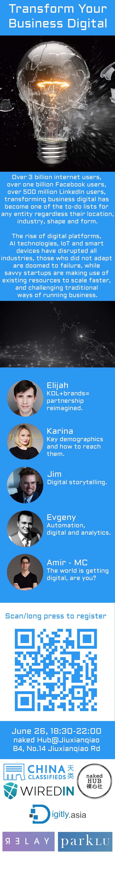

# Traditional Business Transformation with Technology

* [Slides](assets/slides.pdf) (PDF)
* [Event Page](https://www.eventbank.cn/event/10147/)
* [Event Flyer](assets/flyer.jpg)

## Presented by Evgeny Demchenko

Until recently Evgeny was a CTO of a [Chinese cruise booking platform](https://www.ylly.com/) taking an offline traditional travel agency business to become a software business. And now he's a CTO of a recruitment company taking it through a similar transformation.

He's also the organizer of the [Beijing Python Meetup](https://www.meetup.com/Beijing-Python/).

## Takeaways

### Automation helps to reduce costs

By automating parts of your business flow while still keeping a "human in the loop" you can make your business model more scalable and grow your volume without increasing headcount in operations.

### Digital products help to engage customers

Especially in the younger demographics, customers like to "self-serve" and use software to solve their needs rather than traditional ways.

### Analytics help to make data-driven business decisions

Making the software core of a business and instrumenting it with event tracking and metrics allows the business to be data-driven, make better decisions and be competitive.

## Talk outline

* Every company is becoming a software company
* It's important for traditional businesses to embrace technology as a core part of the business in order to stay competitive
* Automation use-cases to reduce operating costs and scale the business model
* Use digital products to engage your customers
* Use analytics tools to make data-driven busines decisions

## Event flyer

